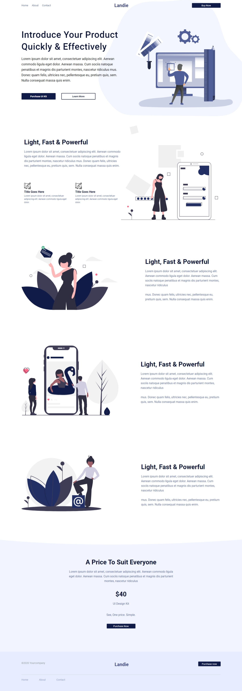
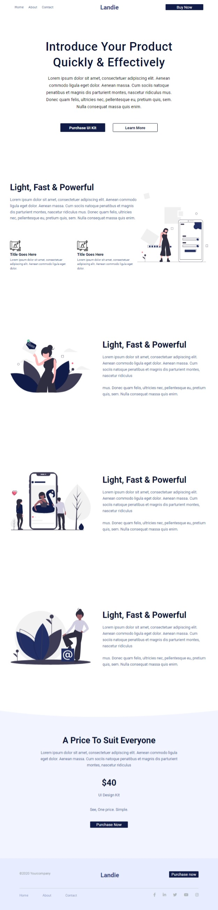
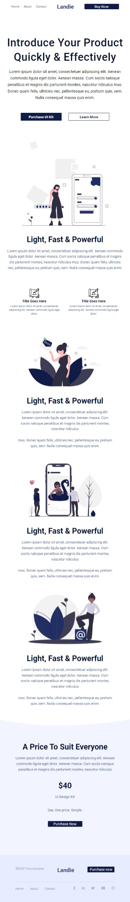

<h1 align="center">Projeto Landie</h1>
 
 
Esse site simples e responsivo foi criado para poder ser usado de template para a criação de outros sites através do HTML, CSS e SASS (No começo eu usei ele para treinar SASS para poder pegar prática)

 

 
 
 
 

 

## Links importantes
- [Meu perfil](https://github.com/EriickW)
- [Site no ar](https://eriickw.github.io/Landie/)

 

## Screenshots

 ### Desktop (1360px)
  
   

  

   

 ### Tablets (700px)

   

  

   

### Moblie/Celular (400px)

   

  

   

## Observações
- Se quiser melhorar esse site eu aceito qualquer sugestão 
- Caso tenha gostado basta baixar uma cópia 
